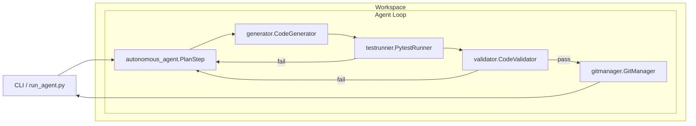

# FlameMirror Architecture

FlameMirror executes a deterministic five-stage loop that maps to real-world
development practices. Each stage is implemented as a dedicated module so that
they can be replaced or extended in isolation.

```
┌────────┐     ┌─────────┐     ┌──────────┐     ┌────────────┐     ┌─────────┐
│ Plan   │ --> │ Generate│ --> │ Test     │ --> │ Validate   │ --> │ Commit  │
└────────┘     └─────────┘     └──────────┘     └────────────┘     └─────────┘
```



The CLI seeds the loop with a workspace path and optional flags. Each stage only
depends on the public API of the next component which keeps the architecture
resilient to refactors.

## Core Modules

- `autonomous_agent.py` — orchestrates the loop and coordinates fuzzy guidance
  and Crucible training feedback.
- `generator.py` — exposes `CodeGenerator` which can synthesize code locally or
  through the GraphformicCoder backend.
- `validator.py` — statically analyzes generated code, computing lightweight
  complexity metrics.
- `testrunner.py` — wraps `pytest` execution with dependency injection for
  reliable tests.
- `gitmanager.py` — stages files and performs commits (dry-run by default).

## Machine Learning Layer

The `ml/` package provides opt-in LLM assistance.

- `model.py` — implements `GraphformicCoder` and the optional `CodexBackend`.
- `sandbox.py` — executes generated code under a restricted environment.
- `trainer.py` — coordinates reinforcement-style self-improvement, logging
  failures and persisting checkpoints.

## Fuzzy Guidance

`fuzzy/engine.py` evaluates rules from `fuzzy/rules.yaml` and returns human-like
advice used to reprioritize plan steps. Rules can be modified without changing
code, providing a flexible experimentation surface.

## Continuous Learning

Failed tasks are appended to `training_problems/failed_tasks.jsonl` while
successful episodes create timestamped entries in `checkpoints/`. These
artifacts drive long-running Crucible training sessions started via the CLI.

## Example Workflows

Three Jupyter notebooks in `examples/` demonstrate:

1. Running a single agent cycle without ML assistance
2. Enabling the GraphformicCoder backend
3. Applying fuzzy guidance to reorder plan priorities

Each notebook can be executed after installing the package in editable mode.

- `demo.ipynb` (new) showcases the full loop with a stubbed pytest runner so it
  can be executed inside constrained environments.

## Usage Notes

1. Install development dependencies with `pip install -e .[dev]` to obtain the
   linting, typing, and notebook toolchain.
2. Run a dry-run cycle: `python -m flamemirror.cli --workspace ./demo-workspace`.
3. Enable additional capabilities when ready:
   - `--enable-ml` loads the `GraphformicCoder` surrogate model.
   - `--enable-fuzzy` activates fuzzy-rule prioritisation.
   - `--no-dry-run` allows real git commits once a repository is initialised.
4. Review the generated plan, telemetry, and commits inside the workspace.

## Legacy Artifacts

Extensive exploratory prototypes from earlier research phases now live in the
`legacy/` directory. They are excluded from tooling via the Ruff configuration
to keep the production surface focused on the maintained `flamemirror` package.
The raw files remain available for reference without impacting CI quality gates.
